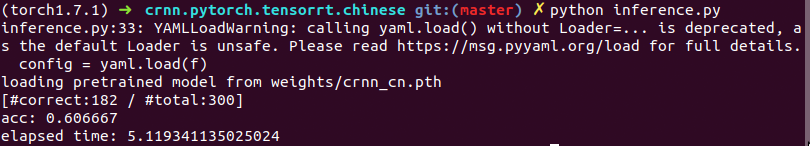
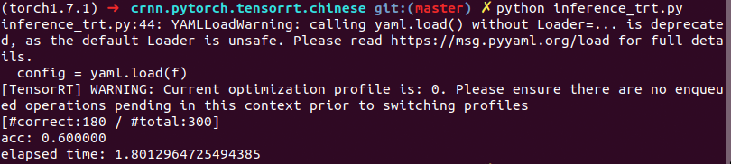

# Chinese Characters Recognition inferenced by tensorrt

A Chinese characters recognition repository with tensorrt format supported based on [CRNN_Chinese_Characters_Rec](https://github.com/Sierkinhane/CRNN_Chinese_Characters_Rec) and [TensorRTx](https://github.com/wang-xinyu/tensorrtx). 

### tensorrt performance 

| Item | performance | 
|:-:|:-:|
| time | -65% |
| GPU memory | -25% |


## Dev Environments
1. Ubuntu 18.04
2. python 3.7
3. PyTorch 1.7.1
4. cuda 10.0, cudnn 7.6.5
5. yaml, easydict, tensorboardX...  
**Options**:
6. OpenCV3.4.1
7. tensorrt7.0.0
8. pycuda>=2019.1.1

### Notes: 
1. Tensorrt should be installed refer to the official documentation if you want to improve the efficiency and save, the version of tensorrt should match the version of ubuntu,cuda,cudnn. Cuda, cudnn and OpenCV should be installed in the system environment to satisfy the compile work. 

## Inference
pytorch .pth weights inference:
   ```
   $ python inference.py
   ```

tensorrt .engine weights inference:
```
$ python inference_trt.py
```

## Train
```angular2html
   $ python train.py --cfg lib/config/cn_config.yaml
```

#### loss curve

```angular2html
   $ cd output/W_PAD/crnn_cn/xxxx-xx-xx-xx-xx/
   $ tensorboard --logdir log
```

## torch to tensorrt
1. You should rebuild crnn torch2trt, if use your own size of input or class number. If not, you can start from step4
```angular2html
   $ cd crnn_trt/build
   $ rm -rf *
```
2. change the parameters in crnn.cpp to yours, you may change INPUT_H, INPUT_W, NUM_CLASS

3. Rebuild crnn torch2trt
```angular2html
   $ cmake ..
   $ make
```
4. Go to root path, and transform torch weights .pth file to .wts. You will get crnn.wts in crnn_trt/build.
```angular2html
   $ cd ../../
   $ python gen_wts.py
```
5. Transform .wts to .engine
```angular2html
   $ cd crnn_trt/build
   $ sudo ./crnn -s
```
6. Move crnn.engine in crnn_trt/build to weights/
7. Run inference.py and inference_trt.py to compare the time use
```angular2html
   $ cd ../../
   $ python inference.py
   $ python inference_trt.py
```
<p align='center'>
</img>
</p>
<p align='center'>
</img>
</p>


## References
- https://github.com/Sierkinhane/CRNN_Chinese_Characters_Rec
- https://github.com/wang-xinyu/tensorrtx


